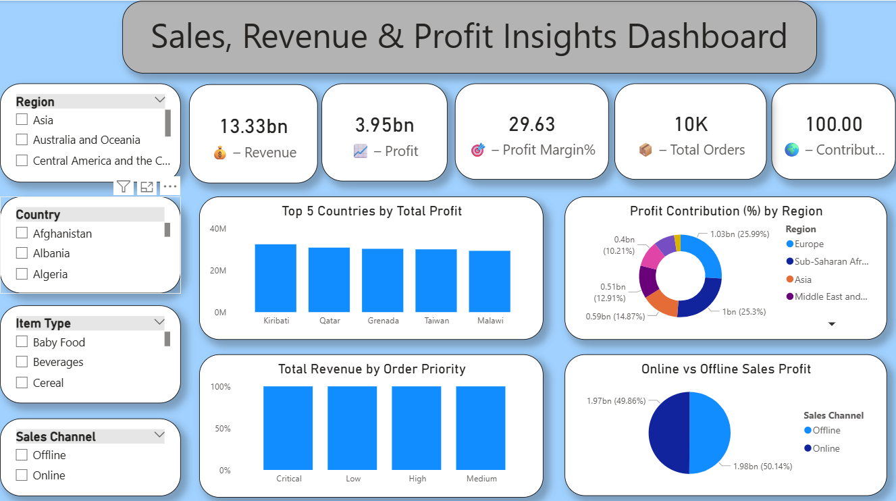
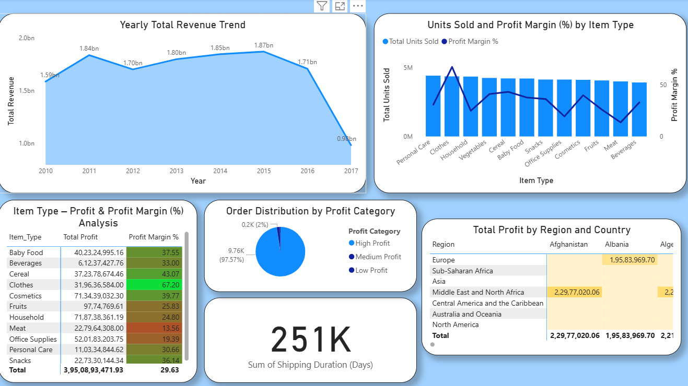

# 📊 Sales, Revenue & Profit Insights Dashboard  
### *End-to-End Data Analysis Project (Excel → MySQL → Power BI)*

This project showcases a complete **data analytics pipeline**, starting from **raw CSV data**, performing **data cleaning in Excel**, loading into **MySQL**, connecting Power BI to the database using **MySQL Connector**, and finally building an **interactive dashboard** for Sales, Revenue, and Profit Insights.

---

## 🚀 Project Workflow

### **1️⃣ Data Cleaning in Excel**
Operations performed:
- Removed duplicates  
- Standardized text formatting  
- Corrected date formats  
- Cleaned missing values  
- Converted data types  
- Created calculated columns (Profit, Profit Margin %, Profit Category)

---

### **2️⃣ Import Into MySQL**
- Created database and table  
- Imported cleaned CSV/Excel into MySQL  
- Verified schema & indexes  
- Performed SQL validation checks  

---

### **3️⃣ MySQL → Power BI Connection**
Using **MySQL Connector**:
- Connected Power BI to MySQL  
- Loaded data into Power Query  
- Applied additional transformations  
- Created data modeling relationships  
- Built KPIs and calculations using **DAX**  

---

## 📈 Dashboard Pages Overview

---

## 🟦 **Page 1 — Sales, Revenue & Profit Overview**
High-level KPIs and comparative analysis.

**Contains:**  
- Total Revenue  
- Total Profit  
- Profit Margin %  
- Total Orders  
- Profit Contribution %  
- Top 5 Countries by Profit  
- Profit Contribution by Region  
- Revenue by Order Priority  
- Online vs Offline Sales Profit  
- Region, Country, Item Type & Sales Channel Slicers  

**📸 Screenshot**  

---

## 🟩 **Page 2 — Trend Analysis & Item Type Insights**

**Contains:**  
- Yearly Total Revenue Trend  
- Units Sold vs Profit Margin % by Item Type  
- Item Type Profit & Margin Table  
- Profit Category Distribution  
- Shipping Duration KPI  
- Profit Heatmap (Region × Country)

**📸 Screenshot**  

---

## 🟧 **Page 3 — Region, Country & Sales Channel Performance**

**Contains:**  
- Region & Country Performance Matrix  
- Revenue Trend by Order Date  
- Tree Map — Profit by Region & Country  
- Revenue by Order Date & Sales Channel  

**📸 Screenshot**  

---

## 🛠️ Technologies Used

| Tool | Purpose |
|------|---------|
| **Excel** | Data Cleaning & Preprocessing |
| **MySQL** | Database Storage & Querying |
| **MySQL Connector** | MySQL → Power BI Connection |
| **Power BI Desktop** | Data Modeling, DAX, Visualization |
| **DAX** | Measures & Business KPIs |
| **Power Query Editor** | Data Transformations |

---

## ⭐ Key Dashboard Features

- Fully interactive dashboard  
- Sync slicers across all pages  
- Clean KPI cards with icons  
- Region-wise drill-down analysis  
- Line, Bar, Pie, Donut, Tree Map, Heat Map visuals  
- Dynamic order date analysis  
- Item-Type-based combined line + bar chart  

---

